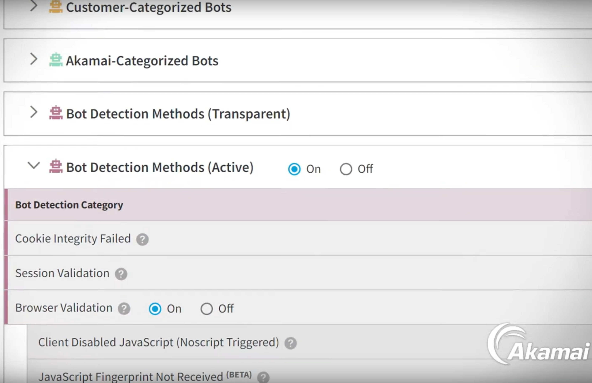
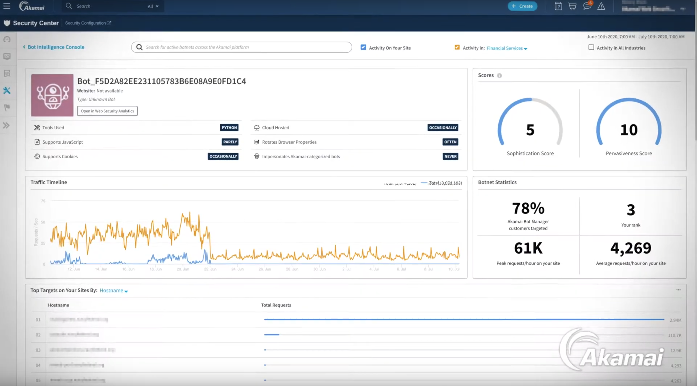
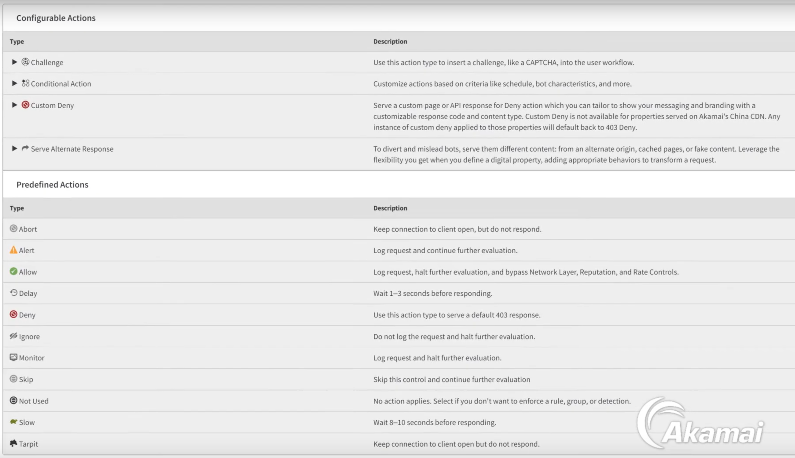

# Akamai Antibot

## What is Akamai Antibot?

Akamai Antibot (officially known as *Akamai Bot Manager*) is a solution offered by Akamai to protect your website from bots. It is expensive and used by many big companies in the world (like Nike, Zara, OLX, Zalando, Footlocker....).

## How it works

The concept behind is quite simple: When you try to access/perform a login, etc in a website protected by Akamai Antibot, it will serve a JavaScript file (known as “collector script”). This script collects some information from your browser and/or behavior (this information is called “sensor data”) and then sends it to Akamai’s servers, where there's a combination of neural networks, etc, to judge whether you are a bot or not. With that, you receive a cookie (called `_abck` cookie).

If your `sensor_data` is good enough (that is, if they think you are a legit user, the information your browser is sharing is correct, etc.), then they will send you a valid `_abck` cookie and you will be able to access the website normally, otherwise, the cookie will be invalid and your access will be denied (HTTP 403) or throttled.

[Akamain Antibot Schema](img/akamai_antibot_schema.png)

Note that in a common scenario the script will send information to the Akamai servers multiple times with an updated `sensor_data` and the cookie will be updated accordingly.

## How it looks from the customer perspective

The *Akamai Bot Manager* offers some different screens and configurations.

The customer can configure how to detect Bots:



And from that rules, it is built a profile for every bot:



Note that these bots are not just those coming from the same IP, but generated from certain patterns they can detect. Once a profile is created, they add a name and provide some insights like tools used (Python, JavaScript, etc), if it supports JavaScript rendering and/or cookies, if it rotates Browser properties, etc.

Once the bot profile is created, there are some rules that are applied to avoid undesired access. Those rules can be like "*block the bot to access to my website during 15 minutes if it is trying to access more than 1K times in 10 minutes*".

Not only "blocking" the access is allowed. Other alternatives are listed here:



## Other information they collect

It is known that, apart from using the information from the `sensor_data`, Akamai Antibot also uses other information from the requests themselves like:

- **header order:** does it match the order used by the declared User-Agent?
- **IP:** as most of these tools, they can detect if an IP is from a datacenter, etc. To bypass this it is recommended to use Residential IPs.
- **TLS fingerprinting**: they can know if the TLS fingerprinting matches the declared User-Agent by using ja3 and/or ja3s.

## Is it possible to bypass the Akamai Antibot?

There’s a risk when implementing these solutions for detecting bots: *False positives*. Banning legit users can upset real customers, but reducing detection sensitivity to decrease the risk of false positives can lead to a flood of false negatives, letting too many bots pass through.

This leaves room for creativity and innovation: **if you are able to build a bot that sends credible `sensor_data` to Akamai, you will be able to access the website.** However, not all are good news: Akamai has been improving their detection methods and it is really hard to find a valid workable solution.

## How to bypass Akamai Antibot

There are different approaches on how to bypass Akamai Antibot.

### Automating browsers

That means using a real browser or headless browsers (selenium, puppeteer, etc) to get the information.

Advantages:

- Not needing to worry about most of the aspects: what de collector script says, headers order, TLS fingerprinting, etc.

Disadvantages

- Frameworks like Selenium can be easily tagged and detected by Akamai.
- The variability is null. To get variability you need to automate different browsers.
- The execution speed will be lower than using other approaches.
- Debugging issues can be harder.

### Synthetic sensor_data

That means generating a `sensor_data` programmatically that can be accepted by the Akamai servers. 

Advantages:

- Easier deployment
- Faster.
- More variability

Disadvantages:

- It is complex to implement as it requires to understand the JavaScript file, building code, etc.
- You need to use a TLS spoofer (like [uTLS](https://github.com/refraction-networking/utls) in go or [myTLS](https://github.com/zedd3v/mytls) and [Cycle TLS](https://github.com/Danny-Dasilva/CycleTLS) in JavaScript/nodejs) to be credible and avoid mid-term bans. More on this is the [TLS Fingerprinting section](tls_fingerprinting.md).

## In-depth: Understanding the "Collector Script" and "sensor_data"

Let’s understand how the “collector script” is and how the “sensor_data” is composed.

**Collector script**

The "collector script" is served from the website. It contains a weird name and it is identifiable because it contains a variable called `bmak`.

Example: [https://a1.bbvanet.com.mx/j7Qdc3mYE/QX2x/6To3w/9fcOXtXc5wr5/RkQCTFVf/ID/F3TmVmEwY](https://a1.bbvanet.com.mx/j7Qdc3mYE/QX2x/6To3w/9fcOXtXc5wr5/RkQCTFVf/ID/F3TmVmEwY)

**This script is highly obfuscated**. To get a cleaner version of it, you can use this website: [https://lelinhtinh.github.io/de4js/](https://lelinhtinh.github.io/de4js/). You can copy the script there and click over “Array”. It will handle some operations and the script will be a little bit more readable.

Inside this script, there are different rules that **will collect the information and trigger POST calls with the `sensor_data`.**

Note that this script can change at any moment.

**Sensor_data**

The `sensor_data` is a string that it's generated by the collector script and contains all the collected values.

Example:

```
7a74G7m23Vrp0o5c9275901.7-1,2,-94,-100,Mozilla/5.0 (X11; Ubuntu; Linux x86_64; rv:90.0) Gecko/20100101 Firefox/90.0,uaend,11123,20100101,es-ES,Gecko,0,0,0,0,400710,8981530,1920,1173,1920,1200,1920,334,1920,,cpen:0,i1:0,dm:0,cwen:0,non:1,opc:0,fc:1,sc:0,wrc:1,isc:141,vib:1,bat:0,x11:0,x12:1,5575,0.956115333478,814294490764,0,loc:-1,2,-94,-101,do_en,dm_en,t_en-1,2,-94,-105,0,0,0,1,914,914,0;1,0,0,1,883,883,0;-1,2,-94,-102,0,0,0,1,914,914,0;1,0,0,1,883,883,0;-1,2,-94,-108,-1,2,-94,-110,-1,2,-94,-117,-1,2,-94,-111,-1,2,-94,-109,-1,2,-94,-114,-1,2,-94,-103,-1,2,-94,-112,https://a1.bbvanet.com.mx/mexiconetblg/servlet/Home?tarjeta=155152162159153150160157162159154156159158165160AB69AB339921948462&servicio=n&pcol=IF09&nvoportal=resp&a=187178174192184186AB215AB157854644399&cloud=true&cam=true-1,2,-94,-115,1,32,32,0,0,0,0,5,0,1628588981528,-999999,17422,0,0,2903,0,0,12,0,0,483FD5A07123F3947143F24D1F14E9AF~-1~YAAQ70l7XMR/PiF7AQAArbh3LwY9CJwiA4ZBWELYrh0HdZ0BBeuIQmeK7HO5VcqLErcdY8KvnGhAH7wBqSHufpUy4PztMTO+fW8shwGzKsudFllDB5nfWX62EJQmL224VER1zlte0XRAUNKOeNxJXqwDfUBAHXEbOjGUYo19m9PnK68i8YqgT/hVLoaDLn8AuUgYJXAHmLjdq6jvblZ2vV7ohs88qmJJiVq0S9Ao7fiyeiJsPR9+zgVrKaJd0k34+/PmU2pNmZEaFOuh4jsLbcOKZT2aZDHDmNEbxPluDmVKmxBB1XOpbzZ1rZujDfQW7b9rpSq4wGcufNDsNwmdLY+wv9bKKYYiUaAtrQw0QwTu4zQsY53bGmi8s0d6JCdF+iEL/eI5LNSOE/9/NUU=~-1~-1~-1,37141,-1,-1,25543097,PiZtE,30744,71,0,-1-1,2,-94,-106,0,0-1,2,-94,-119,-1-1,2,-94,-122,0,0,0,0,1,0,0-1,2,-94,-123,-1,2,-94,-124,-1,2,-94,-126,-1,2,-94,-127,8-1,2,-94,-70,-1-1,2,-94,-80,94-1,2,-94,-116,242501418-1,2,-94,-118,98087-1,2,-94,-129,-1,2,-94,-121,;124;-1;0
```

It is quite hard to read it as-is, but there are some Open Source tools that help to understand what contains and perform some checks. Here it is the output of using the [akamai-toolkit](https://github.com/OXDBXKXO/akamai-toolkit) (`node toolkit.js -p`):

```
**Parsed sensor_data:**
Browser information
bmak.uar(): Mozilla/5.0 (X11; Ubuntu; Linux x86_64; rv:90.0) Gecko/20100101 Firefox/90.0
bmak.ab(bmak.uar()): 5575
bmak.psub: 20100101
bmak.lang: es-ES
bmak.prod: Gecko
bmak.plen: 0
bmak.loc (always empty): 
bmak.nav_perm: 8
bmak.brv: 0

Automation detection
bmak.sed(): 0,0,0,0,1,0,0
bmak.xagg: 11123
bmak.pen: 0
bmak.wen: 0
bmak.den: 0
bmak.hbs(): 0
bmak.gwd(): -1

Browser detection (bmak.bd())
window.callPhantom: cpen:0
window.ActiveXObject: i1:0
"number" == typeof document.documentMode: dm:0
window.chrome && window.chrome.webstore: cwen:0
navigator.onLine: non:1
window.opera: opc:0
"undefined" != typeof InstallTrigger: fc:1
Object.prototype.toString.call(window.HTMLElement).indexOf("Constructor"): sc:0
typeof window.RTCPeerConnection || "function" == typeof window.mozRTCPeerConnection || "function" == typeof window.webkitRTCPeerConnection: wrc:1
window.mozInnerScreenY: isc:141
"function" == typeof navigator.vibrate: vib:1
"function" == typeof navigator.getBattery: bat:0
Array.prototype.forEach: x11:0
"FileReader" in window: x12:1

Screen size
window.screen.width: 1920
window.screen.height: 1200
window.screen.availWidth: 1920
window.screen.availHeight: 1173
window.innerWidth: 1920
window.innerHeight: 334
window.outerWidth: 1920

Events
Special events status: do_en,dm_en,t_en
bmak.kact (Keys events): 
bmak.mact (Mouse events): 
bmak.tact (Touch events): 
bmak.pact (Pointer events): 
bmak.doact (DeviceOrientation events): 
bmak.dmact (DeviceMovement events): 
bmak.vcact (VisibilityChange events): 

Coherence check (115))
bmak.ke_vel + 1: 1
bmak.me_vel + 32: 32
bmak.te_vel + 32: 32
bmak.doe_vel: 0
bmak.dme_vel: 0
bmak.pe_vel: 0
k (vels sum): 0
bmak.updatet(): 5
bmak.init_time: 0
bmak.start_ts: 1628588981528
bmak.fpcf.td: -999999
bmak.d2: 17422
bmak.ke_cnt: 0
bmak.me_cnt: 0
bmak.pi(bmak.d2 / 6): 2903
bmak.pe_cnt: 0
bmak.te_cnt: 0
bmak.get_cf_date() - bmak.start_ts: 12
bmak.ta: 0
bmak.n_ck: 0
bmak.get_cookie(): 483FD5A07123F3947143F24D1F14E9AF~-1~YAAQ70l7XMR/PiF7AQAArbh3LwY9CJwiA4ZBWELYrh0HdZ0BBeuIQmeK7HO5VcqLErcdY8KvnGhAH7wBqSHufpUy4PztMTO+fW8shwGzKsudFllDB5nfWX62EJQmL224VER1zlte0XRAUNKOeNxJXqwDfUBAHXEbOjGUYo19m9PnK68i8YqgT/hVLoaDLn8AuUgYJXAHmLjdq6jvblZ2vV7ohs88qmJJiVq0S9Ao7fiyeiJsPR9+zgVrKaJd0k34+/PmU2pNmZEaFOuh4jsLbcOKZT2aZDHDmNEbxPluDmVKmxBB1XOpbzZ1rZujDfQW7b9rpSq4wGcufNDsNwmdLY+wv9bKKYYiUaAtrQw0QwTu4zQsY53bGmi8s0d6JCdF+iEL/eI5LNSOE/9/NUU=~-1~-1~-1
bmak.ab(bmak.get_cookie()): 37141
bmak.fpcf.rVal: -1
bmak.fpcf.rCFP: -1
bmak.fas(): 25543097
bmak.ff(80) + bmak.ff(105) + bmak.ff(90) + bmak.ff(116) + bmak.ff(69): PiZtE
bmak.jrs(bmak.start_ts)[0]: 30744
bmak.jrs(bmak.start_ts)[1]: 71

Challenges
S = bmak.mn_r[bmak.mn_get_current_challenges()[1]]: 
E = bmak.mn_r[bmak.mn_get_current_challenges()[2]]: 
M = bmak.mn_r[bmak.mn_get_current_challenges()[3]]: 

Fingerprinting
bmak.mr: -1
bmak.fpcf.fpValstr: -1
bmak.ab(bmak.fpcf.fpValstr): 94

bmak.fpcf.fpValstr (70)
canvas("<@nv45. F1n63r,Pr1n71n6!"): -1
canvas("m,Ev!xV67BaU> eh2m<f3AG3@"): undefined
bmak.runFonts ? bmak.altFonts ? t.fonts_optm() : t.fonts() : "dis": undefined
pluginInfo(): undefined
sessionStorageKey(): undefined
localStorageKey(): undefined
indexedDbKey(): undefined
timezoneOffsetKey(): undefined
webrtcKey(): undefined
screen.colorDepth ? screen.colorDepth : -1: undefined
screen.pixelDepth ? screen.pixelDepth : -1: undefined
navigator.cookieEnabled ? navigator.cookieEnabled : -1: undefined
navigator.javaEnabled ? navigator.javaEnabled() : -1: undefined
navigator.doNotTrack ? navigator.doNotTrack : -1: undefined

w (129)
bmak.fmh (installed fonts hash): undefined
bmak.fmz (window.devicePixelRatio): undefined
bmak.ssh (speech synthesis hash): undefined
bmak.wv: undefined
bmak.wr: undefined
bmak.weh: undefined
bmak.wl: undefined

Target info
bmak.getdurl(): https://a1.bbvanet.com.mx/mexiconetblg/servlet/Home?tarjeta=155152162159153150160157162159154156159158165160AB69AB339921948462&servicio=n&pcol=IF09&nvoportal=resp&a=187178174192184186AB215AB157854644399&cloud=true&cam=true
bmak.informinfo: 0,0,0,1,914,914,0;1,0,0,1,883,883,0;
bmak.getforminfo(): 0,0,0,1,914,914,0;1,0,0,1,883,883,0;

Sensor_data info
API public key hash: 7a74G7m23Vrp0o5c92759
Akamai version: 01.7
bmak.aj_type: 0 -> bmak.startTracking(): Initialisation
bmak.aj_indx: 0
Sensor_data generation time (ms): 124
bmak.startTracking() execution time (ms): -1
Public API key hash generation time (ms): 0

Miscellaneous variables
bmak.z1 = bmak.pi(bmak.start_ts / (2016 * 2016)): 400710
bmak.d3 = bmak.get_cf_date() % 1e7: 8981530
randNum.toString().slice(0, 11) + bmak.pi(1e3 * randNum / 2): 0.956115333478
bmak.o9: 242501418
bmak.start_ts() / 2: 814294490764

**Miscellaneous checks:**
ke_vel check:            PASSED
me_vel check:            PASSED
te_vel check:            PASSED
pe_vel check:            PASSED
doe_vel check:           PASSED
dme_vel check:           PASSED
vel_sum check:           PASSED
ta check:                PASSED
d2/6 check:              PASSED
d3 check:                PASSED
z1 check:                PASSED
tst check:               PASSED
fpcf_td check:           PASSED
start_ts/2 check:        PASSED
bmak.aur() hash check:   PASSED
bmak.hbs() check:        PASSED
fpValStr hash check:     PASSED
sensor hash (118) check: PASSED
```

On the other hand, here it is an example of part of the script generating part of the `sensor_data` (`bmak.bpd()`):

```jsx
bmak.sensor_data = bmak.ver + '-1,2,-94,-100,' + n + '-1,2,-94,-101,' + i + '-1,2,-94,-105,' + bmak.informinfo + '-1,2,-94,-102,' + c + '-1,2,-94,-108,' + bmak.kact + '-1,2,-94,-110,' + bmak.mact + '-1,2,-94,-117,' + bmak.tact + '-1,2,-94,-111,' + bmak.doact + '-1,2,-94,-109,' + bmak.dmact + '-1,2,-94,-114,' + bmak.pact + '-1,2,-94,-103,' + bmak.vcact + '-1,2,-94,-112,' + b + '-1,2,-94,-115,' + w + '-1,2,-94,-106,' + d;
bmak.sensor_data = bmak.sensor_data + '-1,2,-94,-119,' + bmak.mr + '-1,2,-94,-122,' + S + '-1,2,-94,-123,' + B + '-1,2,-94,-124,' + x + '-1,2,-94,-126,' + M + '-1,2,-94,-127,' +
bmak.nav_perm;
var P = 24 ^ bmak.ab(bmak.sensor_data);
bmak.sensor_data = bmak.sensor_data + '-1,2,-94,-70,' + bmak.fpcf.fpValstr + '-1,2,-94,-80,' + y + '-1,2,-94,-116,' + bmak.o9 + '-1,2,-94,-118,' + P + '-1,2,-94,-129,' + E + '-1,2,-94,-121,';
```

Once the `sensor_data` is collected, it is sent to the server with a POST in the next format:

```jsx
{"sensor_data":"<sensor_data>"}
```
