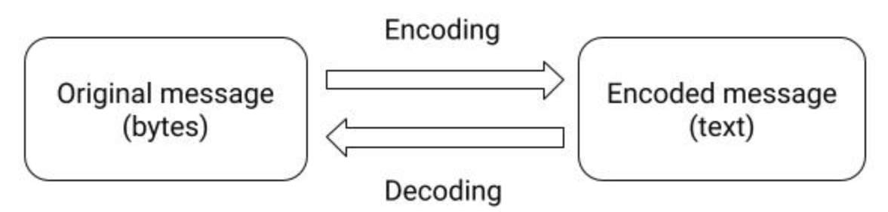
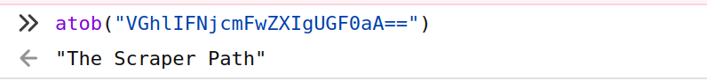
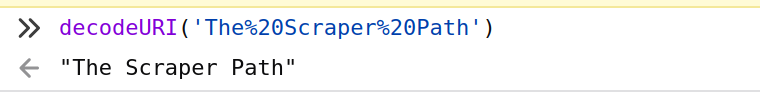
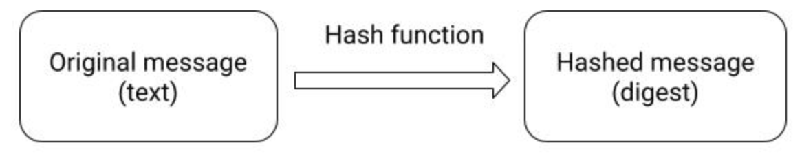

# Cryptography

Cryptography is a very **complex discipline** based on complex mathematic theorems. Understanding cryptography and cryptography attacks require much study, but I decided to try to explain some **basic concepts that can be useful when trying to scrape and understand protected systems** like complex JavaScript, APIs with encrypted parameters, or when trying to reverse engineer android APKs and APIs.


## What is "Cryptography"?
Cryptography is the practice and study of techniques for **secure communication** in the presence of adversarial behavior. Since the advent of the internet, it has become **one of the most important components of the digital world**, and a lot of things couldn't be possible today without cryptography: HTTP and TLS/SSL, SSH, Wifi passwords, digital rights management, bank transactions...

Having some notions of Cryptography will help to **understand underlying systems and eventually reproduce or attack them**. 


_Note: for next Python examples I will assume this Python code executed before:_

```python
# Creating text and encoding to utf-8
>>> text = "The Scraper Path"
>>> bytes_text = text.encode()  # used to encode in utf-8
>>> bytes_text
b'The Scraper Path'
```


## Encoding bytes to strings (Binary-to-text encoding schemes)
Right... "Encoding" is not exactly a cryptographic term, but it will be really important to understand how encoding works to be able to understand some aspects of cryptography because it is extensively used when encrypting things.

Different encodings can be used to store or express strings, like ASCII or UTF. Although they are different, both are a way to represent text and both are broadly used.

However, if we need to **store or express some bytes** (like images or other files) **in channels that only support text content**, we need a way to represent those bytes using characters. This is possible with what it's called **"binary-to-text encoding schemes"**, a way to transform binary into a text string. Some common binary-to-text encoding schemes are base64, hex, and URL encoding.


These encoding schemes are always **reversible**, and can be applied in both directions:

* **Encoding**: when transforming from bytes to text-encoded bytes.
* **Decoding**: when transforming from text-encoded bytes to bytes.




### Base64
This is one of the most common binary-to-text encoding schemes because of its efficiency. It uses 4 characters to represent 3 bytes.

It can be used to embed image files or other binary assets like PDF files inside textual assets like HTML, XML, or JSON. CSS files can contain and render images in base64 and it is also common in HTTP Headers.

Some programmers even use it to "obfuscate" text information without needing to use cryptography keys. Of course, this approach is quite insecure, but it is sometimes applied.


#### Example:

`'The Scraper Path'` ➜ `'VGhlIFNjcmFwZXIgUGF0aA=='`

#### Example using Python:
```python
>>> import base64

# Base64 encoding:
>>> encoded_bytes = base64.b64encode(bytes_text)
>>> encoded_bytes
b'VGhlIFNjcmFwZXIgUGF0aA=='
>>> encoded_bytes.decode()  # string representation
'VGhlIFNjcmFwZXIgUGF0aA=='

# Base64 decoding
>>> decoded_bytes = base64.b64decode(encoded_bytes)
>>> decoded_bytes
b'The Scraper Path'
>>> decoded_bytest.decode()  # string representation
'The Scraper Path'
```


#### Tricks and uses when scraping

They can be **found on JSON, XML, HTML, CSS, etc. files** to **represent images, PDFs, etc**.

To **recognize base64 strings** you can think of this:
* are usually long strings (but they can be short if they represent small data)
* usually finish with "=" due to the padding
* can have different lengths (in comparison with hashes where length is always the same)
* have small differences when the content differs only a little

If you suspect that something is base64 encoded data, you can easily **check** if the content is a string. To do it you can use the explained Python methods or directly in the **JavaScript console** by using the `btoa()` (encode) and `atob()` (decode) methods.




It's also really useful to know that **"ey" is the base64 representation of "{"**. It is quite common to see a long string starting with "ey", and this reveals that it's probably a JSON base64 encoded. An example is the JWT (JSON Web Token), broadly used to create authentication tokens used in HTTP Headers.


### Hex
It is not so common as base64 but it **has its own applications**, like representing the output of a hash algorithm (more on this in the "Hash functions" section. It would be the same as "base16", and it takes two characters for each byte, so **the efficiency is not as high as base64**. It uses digits from 0 to 9 and letters from A to F (16 elements in total), and sometimes appears prefixed with "0x".


#### Example:

`'The Scraper Path'` ➜ `54686520536372617065722050617468'` or `'0x54686520536372617065722050617468'`

#### Example using Python:

```python
# Hex encoding:
>>> encoded_text = text.encode().hex()
>>> encoded_text
'54686520536372617065722050617468'

# Hex decoding
>>> import codecs
>>> codecs.decode(encoded_text, "hex")
b'The Scraper Path'
>>> codecs.decode(encoded_text, "hex").decode()
'The Scraper Path'
```

##### Tricks and uses when scraping
Not as common as base64 when scraping, but they can be found in some places.

Some characteristics to **recognize** them:
* only contain the next 16 chars: 0, 1, 2, 3, 4, 5, 6, 7, 8, 9, A, B, C, D, E, F. 
* can have different lengths (in comparison with the hashes)
* can be also easily recognized if they are preferred by "0x".


### Percent-encoding or URL-encoding
It transforms arbitrary data in a "URI" using only some ASCII characters. It is common in URLs as well as when sending HTML forms through the HTTP POST method using the `application/x-www-form-urlencoded` media type.


#### Example:

`'The Scraper Path'` ➜ `'The%20Scraper%20Path'`

#### Example using Python:

```python
>>> from urllib import parse

# URL encoding:
>>> encoded_text = parse.quote(text)
>>> encoded_text
'The%20Scraper%20Path'

# URL decoding
>>> parse.unquote(encoded_text)
'The Scraper Path'

# Note that both encoding and decoding can be applied to bytes
```

#### Tricks and uses when scraping

This is probably the **easiest to recognize** of the mentioned encodings, especially due to the **presence of "%" (and "%20")**. 

To quickly get the original value, you can use the **JavaScript console** with methods `decodeURI()` and `encodeURI()`.




## Hash functions

A hash function is a cryptographic function that takes an input of variable length and returns a fixed-size alphanumeric string. This result string is known as "hash value", "message digest", "digital fingerprint", "digest" or "checksum".

These functions have differents uses like:
* Verifying integrity
* Signature generation
* Password verification
* Build fast look-up tables


There are several important characteristics that they need to accomplish, but some of the most important facts are:

* **One-way / non-reversible**: it is not possible to get the original value from the hash value. That's the same as saying that the result does not contain the same information as the original text, but it is instead a comprehension of it.
* **Deterministic**: the same input always returns the same output.
* **Low cost**: Calculating a hash should have a low computational and memory cost.
* **"Avalanche effect"**: A small change to the message produces a highly different and uncorrelated result.

Common examples are MD5, SHA (SHA-1, SHA-2, SHA-3...), and blake2.





### MD5
It is not considered secure anymore but is extensively used, especially for verifying data integrity. Produces a digest of 128 bits (16 bytes). 

#### Example:

`'The Scraper Path'` ➜ `'77c30176ffdecdca45c24ef3752f163a'`

#### Example using Python:

```python
>>> from hashlib import md5
>>> md5(bytes_text).hexdigest()
'77c30176ffdecdca45c24ef3752f163a'
```

### SHA
SHA has been evolving from the first version (SHA-1) to the newest one (SHA-3). Here are the differences:

* **SHA-1**: It is not considered secure anymore. Produces a hash digest of 160 bits (20 bytes). 
* **SHA-2**: consists of two algorithms:
  * **SHA-256**: produces an output of 256 bits (32 bytes)
  * **SHA-512**: produces an output of 512 bits (64 bytes). It is more secure than SHA-256.
* **SHA-3**: Same output sizes as SHA-2, but more secure.


#### Examples:

SHA-1:
`'The Scraper Path'` ➜ `'800c10f410ea39d58fdf68ab01f2355091d642ab'`

SHA-256:
`'The Scraper Path'` ➜ `'21283699d757f5900f9df3c7a47922c1bbc2f7809d116f472b8dd6ba6f1da042'`

SHA-512:
`'The Scraper Path'` ➜ `'1a51db3ef1bbdb7da727d8168d0654795c93223f08d14c346cc10a7b4bbc364d331166cdb13787097633ce999fe916876bed554580abe5c961479fdffddee012'`


#### Examples using Python:

```python
>>> from hashlib import sha1
>>> sha1(bytes_text).hexdigest()
'800c10f410ea39d58fdf68ab01f2355091d642ab'

>>> from hashlib import sha256
>>> sha256(bytes_text).hexdigest()
'21283699d757f5900f9df3c7a47922c1bbc2f7809d116f472b8dd6ba6f1da042'

>>> from hashlib import sha512
>>> sha512(bytes_text).hexdigest()
'1a51db3ef1bbdb7da727d8168d0654795c93223f08d14c346cc10a7b4bbc364d331166cdb13787097633ce999fe916876bed554580abe5c961479fdffddee012'
```


### BLAKE2
It is composed of some hashing functions that haven't been standardized, but they have been widely used because it's faster than SHA-3, SHA-2, SHA-1, and MD5. It produces a digest of 32 bytes (BLAKE2s) or 64 bytes (BLAKE2b).

It is used by some cryptocurrencies, new RAR file format versions, 7zip, etc.

#### Examples:

blake2s:
`'The Scraper Path'` ➜ `'36e6a567fec1f4d184f373ee58d82cf3a8958c7b269ea42d82f7931f2eccddf7'`


blake2b:
`'The Scraper Path'` ➜ `'de770ef12d07e314d3a9af9a9b11881dd68bbed7a5e5721ed1153c80bea2dabb3d52346899c5f6bfea2c53143254b8c239a2d72ff04e409cf8f1eb7f8a897589'`


#### Examples using Python:

```python
>>> from hashlib import blake2s
>>> blake2s(bytes_text).hexdigest()
'36e6a567fec1f4d184f373ee58d82cf3a8958c7b269ea42d82f7931f2eccddf7'

>>> from hashlib import blake2b
>>> blake2b(bytes_text).hexdigest()
'de770ef12d07e314d3a9af9a9b11881dd68bbed7a5e5721ed1153c80bea2dabb3d52346899c5f6bfea2c53143254b8c239a2d72ff04e409cf8f1eb7f8a897589'
```

## MAC functions
They are pretty similar to the hash functions but use a "key". That key is used to produce a "Message Authentication Code" (MAC) that can be used to check if the content has been modified. Hash algorithms without Key can't be used with this goal, as the message could be tempered and the hash recalculated. 

[TODO]


## Encryption algorithms

[TODO: AES and 3DES; CBC, etc.]


