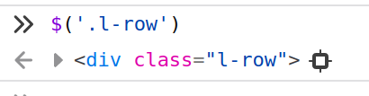

# Data Extraction

When extracting data there are different "tools" we can use. Here there's an analysis of the most important tools, when to use them, how to use them, and good and bad practices.

To go through the examples I will write some Python scripts because it is a language with a high tradition in the scraping world and easy to understand for new commers. However, everything made with Python should be possible with other languages, so don't worry if that's not your target programming language: most of the tips will be useful regardless of the language.


## Index

- JSON
- CSS Selectors
- XPath selectors
- Regex
- Other approaches and tools


## JSON

### When to use it

We can use this approach when the data we are parsing is in JSON format. Consuming JSONs has some advantages over other approaches because it is “machine-readable” and ready for consumption. Moreover some common languages used to scrape supports it pretty well like JavaScript and Python (thanks to the `json` module and the `dictionaries`).

The JSON can be found embedded in the HTML (especially in `<script>` elements or `data` attributes) or it can be directly in the content of a response in case of requesting a JSON API.

### How to use it

The easiest way to parse a JSON is by using the `json` module. It handles all, including the boolean conversion.

```python
>>> json_data = '{"info": {"is_new": true}, "colors": ["grey"], "available": 3}'

>>> import json
>>> data = json.loads(json_data)
>>> data
{'info': {'is_new': True}, 'colors': ['grey'], 'available': 3}

>>> data.get('is_new')
True
>>> data.get('available')
3
```

It is also possible to use `jmespath`.

**[TODO]**

### Good and bad practices

1. As a rule of thumb, if you find the same content in the HTML and in a JSON, it is recommended to use the JSON as a source because it will be easier to consume and probably normalized. Also, usually will contain extra information that it's not in the HTML.
2. When consuming JSON as Python dictionaries we have to avoid acceding directly to keys or indexes to avoid getting `KeyErrors` or `IndexErrors`. As we can’t control the content of a JSON found on a website, we should be defensive. A better approach would be using the `.get()` method with default values:

```python
>>> data = {'info': {'is_new': True}, 'colors': ['grey'], 'available': 3}

# Bad practices (they can produce KeyError):
>>> data['info']
>>> data['info']['is_new']

# Better approach:
>>> data.get('info')
# if `info` is not available we will receive `None`.

>>> data.get('info', {}).get('is_new')
# if `info` (or `is_new`) is not available we will receive `None`

# Bad practice (it can cause KeyError and/or IndexError):
>>> first_color = data['colors'][0]

# Better approach:
>>> colors = data.get('colors', [])
>>> first_color = colors[0] if colors else None
```

3. In case of receiving a response that it's a JSON, when using `requests` or `Scrapy`, you can get the dictionary directly by using `response.json()`.

```python
# instead of doing this:
>>> json.loads(response.content.decode('utf-8'))
{'version': '11.0.0.0',
 'release_date': '2021-07-29',
 'description': 'Example description',
 'formatted_release_date': 'Jul 29, 2021'}

# it's better to use:
>>> response.json()
{'version': '11.0.0.0',
 'release_date': '2021-07-29',
 'description': 'Example description',
 'formatted_release_date': 'Jul 29, 2021'}
```

## CSS selectors

### When to use them

Using CSS selectors is really useful when scraping HTML pages. They are easier to write than XPath and in some cases, they are even "better" because the possibility of making a mistake is lower (like when selecting an element by class). This will be explained in the "XPath selectors" section.

Examples of CSS selectors:

- `#hello`: Element with **id "hello"**
- `.example`: Element with **class "example"**
- `div.row`: **Div** element with **class "row"**
- [TODO: add more relevant examples]

[TODO, add link to reference for CSS?]

### How to use them

In next example I will use [parsel](https://pypi.org/project/parsel/) to be able to apply the selectors to the responses, so we can use directly the `css()` method of the `Selector` object (similar to `Scrapy`).


```python
>>> from parsel import Selector
>>> html = """<div><p class="greeting">hello</p><p>this is a test</p></div>"""
>>> sel = Selector(text=html)
>>> sel.css(".greeting").get()
'<p class="greeting">hello</p>'
```


Basic example:

```python
>>> sel.css('div.l-row').get()
'<div class="l-row"> ... </div>'

# Note: use `.get()` to get the first matching element
# and `.getall()` to get a list with all the matching elements.
```

It is also possible to concatenate selectors:

```python
>>> sel.css('#main').css('div.l-row').get()
'<div class="l-row"> ... </div>'
```


For data extraction, we will probably need to get the content of the elements instead of the elements directly. For that reason, `Parsel` also allows to get the text of an element by using `::text`:

```python
# follows the example above
>>> sel.css(".greeting::text").get()
'hello'
```

It is also important to note that using `::text` will return the text of the element, but adding a space before will return the text of all the sub-elements.

```python
>>> from parsel import Selector
>>> html = """
...: <div class="example">good morning<p class="foo">hello</p><p>this 
...: is a test</p></div>
...: """
>>> sel = Selector(text=html)

>>> sel.css(".example::text").getall()  # ::text is right after the element
['good morning']

>>> sel.css(".example ::text").getall()  # ::text is separated
['good morning', 'hello', 'this is a test']
```

**Trick**: if the website you are accessing is using jQuery (most of the websites), you can test your CSS expression by using `$("<css-expression>")` in your browser console:




### Good and bad practices

All you write using CSS selectors can be achieved by using XPath selectors. However, as they are easy to write, you can use them when you don't need any specific feature from XPath or regex.

[TODO: Add]

## **XPath selectors**

### When to use them

XPath selectors are the most powerful way to retrieve elements from HTML and XML files (in fact, the CSS rules are internally translated to XPath). However, it has some particularities that can result in wrong results, so it's really important to pay special attention when writing XPath expressions.

Examples of XPath selectors:

- `id(hello)`: Element with **id "hello"**
- `//div`: **Div** element
- `//*[@data="foo"]`: any element with the attribute `data` filled with `"foo"`
- [TODO: add more relevant examples]

It's also important to understand the differences between using `/` (selecting direct children) and `//` (selecting a descendant):

**Example HTML:**

```markdown
<div>
    <p>...</p> 
    <p>...</p>
    <div>
        <p>...</p>
        <div>
            <p>...</p>
        </div>
    </div>
</div>
```

- **`//div/p`**: select the **p** elements that are a **direct children of a div** element.

```jsx
<div>
    <p>...</p> <-- This
    <p>...</p> <-- This
    <div>
        <p>...</p>
        <div>
            <p>...</p>
        </div>
    </div>
</div>
```

- **`//div//p`**: select the **p** elements that are **descendants of a div.**

```jsx
<div>
    <p>...</p> <-- This
    <p>...</p> <-- This
    <div>
        <p>...</p> <--This
        <div>
            <p>...</p> <-- This
        </div>
    </div>
</div>
```

Here you can find an interesting **cheat sheet with examples of XPath** and the equivalences with CSS or jQuery (when they exist): [https://devhints.io/xpath](https://devhints.io/xpath)

### How to use them

Like we did with CSS selectors, I will use [parsel](https://pypi.org/project/parsel/) to be able to apply the selectors to the responses.

```python
>>> sel.xpath('//div/p').getall()
['<p> ... </p>', '<p>...</p>', '<p>...</p>' ...]
```

Similar to what you get with `::text` in the CSS selectors, to get the text of an element you can use `/text()` and `//text()`.

```python
>>> from parsel import Selector
>>> html = """
...: <div>good morning<p class="foo">hello</p><p>this is a test</p></div>
...: """
>>> sel = Selector(text=html)

>>> sel.xpath("//div/text()").getall()  # text() has only one slash ("/") before
['good morning']

>>> sel.xpath("//div//text()").getall()  # text() has two slashes ("//") before
['good morning', 'hello', 'this is a test']
```

**Trick:** you can test your CSS expression by using `$x("<xpath-expression>")` in your browser console:


### Good and bad practices

Some of the scenarios when it's really useful to use XPath are:

1. We want to get an **HTML/XML element that contains a specific text.**

```python
# We want to extract the color but the li elements can appear in any order:
>>> from parsel import Selector
>>> html = """
...: <ul>
...:   <li>Color: <span>Green</span></li>
...:   <li>Price: <span>50.00€<span></li>
...:   <li>UPC: <span>123456</span></li>
...: <ul>
"""
>>> sel = Selector(text=html)
>>> sel.xpath('.//li[contains(text(), "Color")]/span/text()').get()
'Green'
```

2. We want to get an HTML/XML **element with an attribute** (`class`, `id`...) **that matches only partially.** 

```python
# We want to extract only those `p` elements with a class starting with "meta":
>>> html = """
...: <div>
...:   <p class="meta1">pink</p>
...:   <p class="meta2">purple</p>
...:   <p class="meta3">black</p>
...:   <p class="price"> 3$ </p>
...: </div>
...: """
>>> sel = Selector(text=html)
>>> sel.xpath('//p[contains(@class, "meta")]').getall() 
['<p class="meta1">pink</p>',
 '<p class="meta2">purple</p>',
 '<p class="meta3">black</p>']
```

3. We want to reference the **parent**

```python
# We want to extract the div that it's a parent of the element with id "main"
>>> html = """
...: <div>
...:   <p id="main">Main content</p>
...: </div>
...: <div>
...:   <p id="ignore">This is not useful</p>
...: </div>
...: <div>
...:   <p id="important">Maybe not.</p>
...: </div>
...: """
>>> sel = Selector(text=html)
>>> sel.xpath('id("main")/parent::div').get()
'<div>\n  <p id="main">Main content</p>\n</div>'
```

(Note that the last example could be achieved in multiple ways: with "contains", etc, this is just to show how the parent can be referenced)

Apart from this, as mentioned before, using XPath has some risks, so you have to pay attention. Let's see **some common errors**:

1. You can **concatenate XPath expressions**. However, it's important to add a period (`.`) before the `/` or `//` to indicate that it's a relative selector.

```python
>>>from parsel import Selector
>>> html = """
...: <p>hello</p>
...: <div><p>bye</p></div>
...: """
>>> sel = Selector(text=html)

# if you don't use a period in the second xpath, the root will be the 
# `sel` instead of the previous element:
>>> sel.xpath('//div').xpath('//p').getall()
['<p>hello</p>', '<p>bye</p>']

# to avoid this, you can a period to indicate that the selector is 
# relative:
>>> sel.xpath('//div').xpath('.//p').getall()
['<p>bye</p>']
```

2. When you want to **select an element with a value in the attribute** (for example a class with a specific value), you have to **avoid using an equal:**

```python
# Imagine a response object with this element:
# <div class="main"> ... </div>

# If you want to select that div you could be tempted to use the next 
# expression:
>>> response.xpath('//div[@class="main"]').get()
'<div class="main"> ... </div>'

# this would work. However, this is a bad pattern because the website
# could potentially add more classes to that element and this selector
# would stop working. If the element is now this:
# <div class="main row"> ... </div>
# You wouldn't receive any result
>>> response.xpath('//div[@class="main"]').get()
```

3. Avoid **using "contains" for an attribute** to get an element that can contain that in the attribute:

```python
# To avoid the previous problem (missing element when adding a new class)
# you could be tempted to write this selector:
>>> response.xpath('//div[contains(@class, "main")]').get()

# However, as explained before, this would capture all the divs containing 
# a class that contains the word "main" like these:
# <div class="main3">...</div>
# <div class="maintenance">...</div>
# <div class="cremains">...</div>
```

## Regex

### When to use it

Regex (regular expressions) is probably the most powerful and versatile tool to extract information in most of the scenarios (text), however, the regular expressions are harder to maintain and harder to use. It is recommended to use regex when the other approaches alone (JSON, XPath, CSS selectors...) are not enough.

It's not a secret, that mastering regex is something really hard that can only come with a lot of practice and experience. So don't expect to understand all the rules from the beginning.

Examples:

[TODO: add examples + reference]

### How to use it

In Python it can be used directly by using the **re** module. This module provides multiple methods like `re.findall()`, `re.search()`, `re.match()`...

```python
>>> text = 'Hello Marc! Welcome to this page'

>>> re.findall(r'Hello (.*)! .*', text)
['Marc']

>>> re.search(r'Hello (.*)! .*', text).group(1)
'Marc'

>>> re.match(r'Hello (.*)! .*', text).group(1)
'Marc'
```

To understand how to use them, you can check the [Python 3 docs](https://docs.python.org/3/library/re.html?#module-re).

But thanks to `parsel` it can be applied directly to an element:

```python
# To get all the matching elements use `re()` and you will get a list
>>> sel.re(r'[\d]+')
['4', '3', '23']

# To retrieve only the first element use `re_first()` and you will get
# an element or None
>>> sel.re_first(r'[\d]+')
'4'

# Note that you can apply `re` to an expecific element selected with 
# `.css()` or `.xpath()`:
>>> sel.css('div.main').re_first(r'[\d]+')
'4'

# But you can't concatenate them because they return lists/strings:
>>> sel.re_first(r'Price: (.*)').re(r'[\d.]+')
AttributeError: 'str' object has no attribute 're'

# (to achieve this you can save the result of the `re_first()` and apply 
# regex with the `re` module)
>>> price_text = sel.re_first(r'Price: (.*)')
>>> re.findall(r'[\d.]+', price_text)
['34.00']
```

To match something that is **multiline** you need to specify a `DOTALL` flag (there's also a `MULTILINE` flag, but it's for a different case and you would need anchor tags: `^` and `$`).

```python
import re

# When not using re.DOTALL, the expression doesn't check multiple lines 
# together:
>>> text = """function hello() {
...: "name": "Lluis",
...: "points": 3,
...: }"""
>>> re.findall(r"hello\(\) ({.*})", text)

# Adding re.DOTALL, you can get the desired result
>>> re.findall(r"hello\(\) ({.*})", text, re.DOTALL)
'{\n"name": "Lluis",\n"points": 3,\n}'
```

It is not possible to use regex flags directly when using the selectors provided by `parsel`. However, you can compile the regex expression to get the same result:

```python
>>> import re
>>> from parsel import Selector
>>> text = """function hello() {
...: "name": "Lluis",
...: "points": 3,
...: }"""
>>> sel = Selector(text=text)

>>> sel.re(r"hello\(\) ({.*})")
[]

>>> regex = re.compile(r"hello\(\) ({.*})", re.DOTALL)

>>> sel.re(regex)
['{\n"name": "Lluis",\n"points": 3,\n}']

```

**Trick:** You can use external tools to evaluate regex. However, there are some specific aspects for each language, so it's important to select the correct tool. You can find here an example for Python: [https://pythex.org/](https://pythex.org/)

### Good and bad practices

It is discouraged to use Regex in scenarios where we can use JSON, CSS, or XPath selectors. The reason behind this is that building a good regex matching all the scenarios usually requires a lot of small tweaks and maintaining them is not an easy task.

However, it can be really useful in the following scenarios:

1. When we need to extract something that is a **part of the text we have**:

```python
>>> from parsel import Selector
>>> html = """<p>Price: 24.40€</p>"""
>>> sel = Selector(text=html)
>>> sel.css('p').re_first(r'Price: ([\d.,]+)€')
'24.40'
```

2. When **we don’t know where the information is going to be** (because there are not obvious selectors, etc). 

```python
# An obvious exaple would be if we want to capture a known substring from a text
>>> import re

# In this example, we have a text that it's:
>>> text = "The price for the car is 1,000.34€"
>>> re.findall(r'([\d.,]+)€', text)
['1,000.34']

# But the text could be also this and the expression will also work:
>>> text = "The price for this awesome toy is 8,030.25€ including taxes"
>>> re.findall(r'([\d.,]+)€', text)
['8,030.25']
```

3. When the **data** is not HTML, CSS, etc, but instead, **it is in a different format** (for example, when needing a value inside a JavaScript node).

```python
>>> from parsel import Selector
>>> html = "<script>function foo_bar(variable) { op: 1dsad#456 }</script>"
>>> sel = Selector(text=html)
>>> sel.css('script').re_first(r'{ op: (.*) }')
'1dsad#456'
```

About **good and bad practices**, a lot of things can be considered. Let's see some of the most important:

1. Don't expect the websites to respect spaces. Use `\s*` or `\s+` instead of spaces.

Using the example above, it is true that all these are equivalent (and valid) JavaScript expressions:

```python
"<script>function foo_bar(variable) { op: 1dsad#456 }</script>"
"<script>function foo_bar(variable) {op: 1dsad#456 }</script>"
"<script>function foo_bar(variable)     {op: 1dsad#456 } </script>"
"<script>function foo_bar(variable){ op: 1dsad#456 }</script>"
"<script>function foo_bar(variable) {op: 1dsad#456}</script>"
"<script>function foo_bar(variable){op: 1dsad#456}</script>"
...
```

For that reason, the regex expression we used in the previous example (`r'{ op: (.*) }'`) is not "defensive" enough. The spacing could change at any moment and this expression would stop working. For that reason, for these cases it's better to use the `\s*` to match 0 or more white spaces:

 `r'{\s*op:\s*(.*)\s*}'`

This makes the expression harder to read but will work on all the mentioned scenarios. This can be also useful in other scenarios like:

```python
>>> import re

>>> text = "The price is 1,000.34€"
>>> re.findall(r'([\d.,]+)€', text)
['1,000.34']

# It could be possible to find a space between the price and the currency. 
# And the expression would fail
>>> text2 = "The price is 524,00 €"
>>> re.findall(r'([\d.,]+)€', text2)
[]

# Using this expression: r'([\d.,]+)\s*€' would be safer.
>>> re.findall(r'([\d.,]+)\s*€', text2)
['524,00']

>>> re.findall(r'([\d.,]+)\s*€', text)
['1,000.34']
```

2. **Reduce the scope** before applying a regex.

The regular expressions are usually really fast, but reducing the scope will save resources and will avoid false positives. When it's possible don't apply the regex to the whole content of a response, apply it to the specific section of interest:

```python
>>> sel.css('script[@data-main]').re(r'{ op: (.*) }')
```

3. Don't forget to **escape certain characters**

OK, this is probably obvious, but if you don't know why an expression is not working, check if you forgot to escape the `(`, `)`, `$`, etc.

4. When using the `re` module directly, **remember to use the correct function**

The easiest way to use the `re` module from Python is using the `re.findall()` function. It returns a list containing all the matches:

```python
>>> text = """The 3rd of May of 1934, 3 famous people came to the world: 
...: 1st Henry Cooper, 2nd Georges Moustaki, and 3rd Frankie Valli"""

>>> re.findall(r'\d+', text)
['3', '1934', '3', '1', '2', '3']
```

However, sometimes we only need to retrieve the first element. In that case is better to use the `re.search()` function for better performance, as it will stop scanning the text after getting the first match. That match can be accessed by using the `.group()` method (`group(0)` matches the whole expression, `group(1)` the first group, `group(2)` the second group, and so on).

```python
# following example above 

>>> match = re.search(r'\d+', text)
>>> if match:
...:    print(match.group(0))
3
```

5. **Use non-greedy/lazy quantifiers** unless you really need to match all.

```python
>>> import re
>>> text = """
...: var something = {
...:   value1: {
...:     "interesting": True, 
...:     "boring": False
...:   } 
...: }
...: """
# Imagine you want to capture the JSON inside the value1. You could be 
# tempted to write the next regex: r'value1:\s*{.*}'. However look at the 
# result:
>>> print(re.search(r'value1:\s*({.*})', text, re.DOTALL).group(0))
value1: {
     "interesting": True, 
     "boring": False
   } 
 }

# As you can see, there's an extra '}' character. This is because the .* is 
# "greedy" and it will match all it can, so it searches for the last 
# occurrence of '}'. To avoid this behavior, you have to add the `?` character,
# and it will match the minimum group.
 >>> print(re.search(r'value1:\s*({.*?})', text, re.DOTALL).group(0))
value1: {
     "interesting": True, 
     "boring": False
   }
 
# This seems pretty obvious because of the result, but it's better to use lazy
# selectors even when it's not necessary to prevent a small change in the 
# website from breaking the regex:

# Even if the content is just this:
text = """
...:  value1: {
...:    "interesting": True, 
...:    "boring": False
...: } 
...: """

# don't forget to add the `?` (r'value1:\s*({.*?})'), because it could 
# eventually change.
```

## Other approaches and tools

JSON, CSS, and XPath selectors, along with regex should be enough to extract the information from any HTML (or JSON) page. However, in some specific cases, it could be necessary to use other methods or tools. It's impossible to list all the existing approaches, but let's see some examples to explore in case you need it (note that the references are to Python resources, but there are existing libraries for multiple programming languages).

When needing to **extract information from images** (or **videos**), we can use techniques like:

- **OCR** (one of the most important OCR engines in Python is [Tesseract](https://github.com/tesseract-ocr/tesseract))
- **Machine Learning models**

When needing to **access a value from the JavaScript** code that it's not obviously accessible, you can use different approaches. 

- **Using libraries to handle JavaScript objects:** Like [chompjs](https://github.com/Nykakin/chompjs). This is only valid if the values are in the JavaScript code, it doesn't allow to access values dynamically created.
- **Run JavaScript** with nodejs: [PyExecJS](https://pypi.org/project/PyExecJS/).
- **Rendering websites**: you can use (headless) browsers with automation tools like [selenium](https://selenium-python.readthedocs.io/), [puppeteer](https://github.com/puppeteer/puppeteer), etc. This allows to access objects in memory and to reproduce human behaviors, but it requires a lot of resources and time.

When **parsing / normalizing complex things**:

- **Dates** are some of the hardest strings to parse, as there are a lot of different formats. You can parse dates in multiple languages and formats using [dateparser](https://github.com/scrapinghub/dateparser/).
- **Prices** can be also written in different formats. There's a handy Python library called [price-parser](https://github.com/scrapinghub/price-parser) that can handle this.
- **Natural written numbers.** This is not too common, but in some cases, it can be useful to use a library like [number-parser](https://github.com/scrapinghub/number-parser).
